<h3><code>amr@github ~ $ ./contributions.sh</code></h3>

  

<h3><code>amr@github ~ $ whoami</code></h3>
<table>
  <tr>
    <td valign="top"></td>
    <td valign="top"></td>
  </tr>
</table>

 

<h3><code>amr@github ~ $ ls ./links</code></h3>
<code><a href="https://linkedin.com/in/amr-hammoud">linkedin</a></code>&nbsp;
<code><a href="https://dev.to/amr-hammoud">dev.to</a></code>&nbsp;
<code><a href="https://medium.com/@amr-hammoud">medium</a></code>&nbsp;
<code><a href="https://stackoverflow.com/users/16456363/amr-hammoud">stackoverflow</a></code>&nbsp;
<code><a href="https://instagram.com/amr.hammoud">instagram</a></code>

